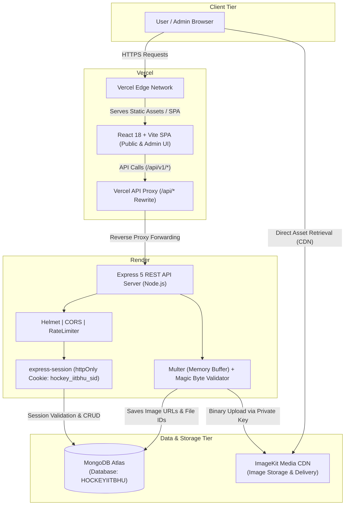

# IIT (BHU) Hockey Digital Archive

A full-stack, archival-grade digital repository and administrative platform dedicated to preserving, organizing, and showcasing over eight decades of collegiate field hockey history, championship campaigns, team rosters, and historical artifacts for the Indian Institute of Technology (BHU) Varanasi.

---

## 1. Project Summary

The **IIT (BHU) Hockey Digital Archive** resolves the historical fragmentation of university athletic records. Decades of inter-collegiate tournament performances, match scores, award citations, player profiles, and archival photographs were traditionally scattered across physical ledgers, memory books, and personal collections.

This platform bridges institutional heritage with modern software engineering by delivering:

1. **A Public Archival Portal**: A curated, editorial-style digital museum enabling students, alumni, faculty, and sports historians to explore chronological milestones, yearly squad rosters, tournament edition campaigns, individual player biographies, match records, and digitized media collections.
2. **An Authenticated Admin Management Suite**: A secured administrative system providing athletic directors and team historians with transactional CRUD workflows, relational data integrity enforcement, and cloud media lifecycle management.

```
Public Users / Historians / Alumni
              │
              ▼
   ┌──────────────────────┐
   │    Public Archive    │  ◄── Read-Only Optimized Catalogs & Fast Previews
   └──────────────────────┘
              ▲
              │   Database & Media Pipeline
              ▼
   ┌──────────────────────┐
   │     Admin Suite      │  ◄── Argon2 + Cookie Session Authentication
   └──────────────────────┘
              ▲
              │
Authorized Team Administrators
```

---

## 2. Key Features

### Public Archive Platform

- **Home Showcase**:
  - **Hero Presentation**: Architectural campus hero featuring archival typography and rapid access to historical collections.
  - **Digital Magazine Download**: One-click download of the official _Drona_ Hockey commemorative magazine (`IIT-BHU-Hockey-Magazine.pdf`).
  - **Milestones Section**: Interactive chronological timeline highlighting landmark victories, championship medals, and institutional breakthroughs.
  - **Squad Spotlight**: Real-time showcase of varsity hockey roster members with positional badges.
  - **Archival Vault**: Dynamic masonry gallery preview linking directly into full photographic records.
- **History Timeline**: Chronological narrative of historical events categorized by Major Victories, Championships, Medals, Milestones, and Memorable Performances, accompanied by archival photography.
- **Teams & Yearly Archives**: Year-by-year team records documenting roster compositions, captains, vice-captains, coaching staff, and collective team accolades.
- **Team Details**: Deep-dive team pages displaying full squad lists, tournament campaigns, and season awards.
- **Roster & Player Profiles**:
  - Searchable and position-filtered roster view (Forward, Midfielder, Defender, Goalkeeper).
  - Distinction between **Current Players** and **Former Players / Alumni**.
  - Individual player profiles featuring verified jersey numbers, years active, leadership records, honors won, and career statistics.
- **Tournaments & Editions**:
  - **Tournaments Index**: Master competition records for SPARDHA (IIT BHU), Inter-IIT Sports Meet, General Championship (GC), and Invitational Sports Out Fests.
  - **Tournament Details**: History, description, crest insignia, and chronological edition registry.
  - **Tournament Editions**: Year-specific tournament campaigns featuring host institute records, final institutional standing, participating universities, and edition leadership.
- **Matches & Match Logs**: Comprehensive match logs tracking opponents, rounds/stages, goal scores, and Win/Loss/Draw outcomes.
- **Achievements & Accolades**: Filterable honors registry categorized by Championships, Medals, Awards, Major Victories, and Individual Accolades, with polymorphic links to recipient players or squads.
- **Gallery & Archival Vault**: High-resolution image repository categorized across festival editions, match action, team photographs, and vintage memories with tagged player references.

### Authenticated Admin Platform

- **Dashboard**: System-wide statistics and metric cards showing total players, yearly teams, tournaments, matches, accolades, and media assets with quick-navigation shortcuts.
- **Player Management**: Complete lifecycle management for active athletes and alumni with profile photo uploads, career years, leadership tags, and individual statistics.
- **Team Management**: Yearly team builder facilitating roster assignment, captain/vice-captain designation, coach notation, team portraits, and season honors.
- **Tournament Management**: Master category administration, description editing, and tournament crest insignia management.
- **Tournament Edition Management**: Annual edition coordination linking tournament categories to specific yearly teams, host institutes, standings, achievements, and gallery records.
- **Match Management**: Fixture logging with round classifications, opponent details, score tracking, and match outcome recording.
- **Achievement Management**: Accolade issuance with polymorphic targeting (`recipientType: "Player" | "Team"`).
- **History Management**: Chronological milestone curation with direct image attachment, category classification, and edition linking.
- **Gallery Management**: Media uploads with captioning, event context, category labeling, and player tagging.
- **Search, Filtering & Pagination**: Instant, debounced searching across large datasets with backend pagination (`limit=100` catalog max).
- **Relational Deletion Protection**: Foreign-key reference checks preventing accidental deletion of records linked to active teams, matches, or honors (returning explicit `409 Conflict` errors).

### Security & Infrastructure Highlights

- **Session-Based Authentication**: Server-side cookie sessions powered by `express-session` with `httpOnly`, strict `sameSite`, and `secure` cookie enforcement.
- **Argon2id Password Security**: Passwords hashed using industry-standard Argon2id algorithm before persistence.
- **HTTP Security Headers**: Enterprise HTTP headers applied globally via `helmet`.
- **CORS Origin Whitelisting**: Strict origin validation against configured frontend domains with full credentials forwarding support.
- **Tiered Rate Limiting**: Global DDoS protection paired with aggressive rate-limiting on sensitive authentication endpoints (`/api/v1/auth/login`).
- **Centralized Error Handling**: Unified operational error handling using typed `AppError` instances, with production stack trace and 500-level error masking.
- **ImageKit CDN Integration**: Direct buffer streaming to ImageKit with binary magic-byte file validation, automatic format conversion, and deletion of orphaned assets upon record removal.
- **Client-Side Request Optimization**: In-memory catalog caching with 5-minute TTL, in-flight promise deduplication, search input debouncing, and targeted cache invalidation.

---

## 3. Product & Information Architecture

The platform models university hockey records through a relational schema designed around recurring competitions, specific annual campaigns, participating squads, and individual student-athletes.

```
┌─────────────────┐
│   Tournament    │  (e.g., SPARDHA / Inter-IIT Sports Meet)
└────────┬────────┘
         │ 1
         │
         │ has many (1:N)
         ▼
┌─────────────────┐       has one (N:1)       ┌─────────────────┐
│TournamentEdition├──────────────────────────►│      Team       │
└────────┬────────┘                           └────────┬────────┘
         │                                             │
         ├──────────────────┐                          │ has many (M:N)
         │ 1                │ 1                        ▼
         │ has many (1:N)   │ has many (1:N)  ┌─────────────────┐
         ▼                  ▼                 │     Player      │
┌─────────────────┐  ┌─────────────────┐      └────────┬────────┘
│      Match      │  │  Gallery Item   │               │
└─────────────────┘  └─────────────────┘               │
         ▲                  ▲                          │
         │                  │ tagged in (M:N)          │
         │                  └──────────────────────────┤
         │                                             │
         │             awarded to (Polymorphic)        │
         └───────────────────┬─────────────────────────┘
                             │
                             ▼
                    ┌─────────────────┐
                    │   Achievement   │
                    └────────┬────────┘
                             │
                             ▼ referenced by (N:1)
                    ┌─────────────────┐
                    │  History Event  │
                    └─────────────────┘
```

### Key Entity Distinctions

| Concept                | Purpose                                                                                 | Example                                    |
| ---------------------- | --------------------------------------------------------------------------------------- | ------------------------------------------ |
| **Tournament**         | Master recurring competition or championship category.                                  | _Inter-IIT Sports Meet_                    |
| **Tournament Edition** | A specific annual occurrence of a tournament category.                                  | _Inter-IIT Sports Meet 2024 (IIT Madras)_  |
| **Team**               | The official IIT (BHU) Hockey contingent assembled for a given calendar year.           | _IIT (BHU) Hockey Team 2024_               |
| **Player**             | An individual student-athlete profile, marked as either `current` or `former` (alumni). | _Varsity Center-Forward_                   |
| **Match**              | An individual fixture played by IIT (BHU) during a specific tournament edition.         | _IIT (BHU) vs IIT Kanpur (Semi-Final)_     |
| **Achievement**        | An official accolade, trophy, medal, or individual honor awarded to a player or team.   | _Gold Medal - SPARDHA 2023_                |
| **History Event**      | A narrative milestone representing institutional hockey heritage across the decades.    | _First Inter-IIT Championship Gold (1978)_ |
| **Gallery Item**       | Archival photography or match capture metadata linked to CDN-hosted imagery.            | _1982 Squad Portrait at Banaras_           |

---

## 4. Technology Stack

### Frontend Application

| Technology                                                          | Version    | Purpose                                                       |
| ------------------------------------------------------------------- | ---------- | ------------------------------------------------------------- |
| [React](https://react.dev/)                                         | `^18.3.1`  | Core UI component framework                                   |
| [Vite](https://vitejs.dev/)                                         | `^6.1.0`   | Development server and production build tooling               |
| [TypeScript](https://www.typescriptlang.org/)                       | `~5.7.2`   | Type safety and contract enforcement                          |
| [React Router](https://reactrouter.com/)                            | `^6.29.0`  | Client-side routing with nested layouts and protected routes  |
| [Axios](https://axios-http.com/)                                    | `^1.7.9`   | HTTP client configured with credentials and interceptors      |
| [Tailwind CSS](https://tailwindcss.com/)                            | `^3.4.17`  | Utility-first styling implementing the Heritage design system |
| [shadcn/ui](https://ui.shadcn.com/)                                 | Tailored   | Accessible and composable UI primitives                       |
| [Lucide React](https://lucide.dev/)                                 | `^0.475.0` | SVG iconography                                               |
| [React Hook Form](https://react-hook-form.com/)                     | `^7.54.2`  | High-performance form state management                        |
| [Zod](https://zod.dev/)                                             | `^3.24.2`  | Schema validation for forms and API payloads                  |
| [@hookform/resolvers](https://github.com/react-hook-form/resolvers) | `^3.10.0`  | Integration between React Hook Form and Zod                   |

### Backend Service

| Technology                                                                     | Version    | Purpose                                                 |
| ------------------------------------------------------------------------------ | ---------- | ------------------------------------------------------- |
| [Node.js](https://nodejs.org/)                                                 | `>=20`     | Server JavaScript runtime (ES Modules, NodeNext)        |
| [Express](https://expressjs.com/)                                              | `^5.2.1`   | REST API application framework                          |
| [TypeScript](https://www.typescriptlang.org/)                                  | `^5.9.0`   | Backend type definitions and compilation                |
| [Mongoose](https://mongoosejs.com/)                                            | `^9.9.4`   | MongoDB Object Data Modeling (ODM)                      |
| [Argon2](https://github.com/ranisalt/node-argon2)                              | `^0.45.1`  | Password hashing (Argon2id)                             |
| [express-session](https://github.com/expressjs/session)                        | `^1.19.0`  | Server-side cookie session management                   |
| [Helmet](https://helmetjs.github.io/)                                          | `^8.3.0`   | HTTP security response headers                          |
| [CORS](https://github.com/expressjs/cors)                                      | `^2.8.6`   | Cross-Origin Resource Sharing control                   |
| [express-rate-limit](https://github.com/express-rate-limit/express-rate-limit) | `^8.7.0`   | DoS protection and authentication throttling            |
| [Multer](https://github.com/expressjs/multer)                                  | `^2.3.0`   | Multipart form data and memory buffer file handling     |
| [@imagekit/nodejs](https://github.com/imagekit-developer/imagekit-nodejs)      | `^7.11.0`  | Server-side image asset delivery and transformation SDK |
| [Zod](https://zod.dev/)                                                        | `^4.5.4`   | Strict request parameter, query, and body validation    |
| [tsx](https://tsx.is/)                                                         | `^4.23.12` | TypeScript execution and hot-reloading for development  |

### Infrastructure & Cloud Providers

| Provider          | Purpose                          | Configuration Details                                                        |
| ----------------- | -------------------------------- | ---------------------------------------------------------------------------- |
| **Vercel**        | Frontend Hosting & Reverse Proxy | Static Vite SPA hosting with `/api/(.*)` rewrite proxy to Render             |
| **Render**        | Backend Web Service              | Containerized Node.js service running `dist/server.js`                       |
| **MongoDB Atlas** | Managed Database                 | Cloud MongoDB M0/Atlas replica set running database `HOCKEYIITBHU`           |
| **ImageKit**      | Media Storage & Optimization     | Cloud CDN storing photos, auto-compressing WebP assets, and handling deletes |

---

## 5. System Architecture



### Authentication & Request Flow

1. **Unauthenticated Browsing**: Public endpoints (`GET /api/v1/players`, `GET /api/v1/teams`, etc.) are open to all visitors with rate-limiting and client-side caching.
2. **Admin Login**:
   - Admin submits credentials via `POST /api/v1/auth/login`.
   - Backend verifies against `admins` collection using `argon2.verify()`.
   - Upon success, an encrypted session is recorded in memory and sent to the client as an `httpOnly`, `secure`, `sameSite=none` cookie (`hockey_iitbhu_sid`).
3. **Protected Admin Operations**:
   - Admin mutation requests (`POST`, `PATCH`, `DELETE`) pass through `authMiddleware.ts`.
   - The middleware validates `req.session.adminId` against MongoDB.
   - If valid, request proceeds to controller; otherwise returns HTTP `401 Unauthorized`.

---

## 6. Repository Structure

```
HOCKEYIITBHU/
├── .cursor/                         # Cursor IDE configuration
├── .vscode/                         # Shared workspace settings
├── docs/                            # Architectural design documents & specs
│   ├── API_ENDPOINTS.md
│   ├── API_REQUEST_RESPONSE_STRUCTURES.md
│   ├── API_STANDARDS_AND_CONVENTIONS.md
│   ├── BACKEND_DEVELOPMENT_ROADMAP.md
│   ├── BACKEND_FOLDER_GUIDE.md
│   ├── MONGODB_COLLECTIONS.md
│   ├── MONGODB_COLLECTIONS_COMPLETE.md
│   ├── MONGODB_COLLECTIONS_FINAL.md
│   └── TECH_STACK.md
├── backend/                         # Express + TypeScript REST API
│   ├── src/
│   │   ├── config/                  # External service adapters (MongoDB, ImageKit)
│   │   │   ├── database.ts
│   │   │   └── imageKit.ts
│   │   ├── controllers/             # Thin HTTP request & response handlers
│   │   │   ├── achievementController.ts
│   │   │   ├── authController.ts
│   │   │   ├── galleryItemController.ts
│   │   │   ├── historyEventController.ts
│   │   │   ├── matchController.ts
│   │   │   ├── playerController.ts
│   │   │   ├── teamController.ts
│   │   │   ├── tournamentController.ts
│   │   │   └── tournamentEditionController.ts
│   │   ├── middleware/              # Cross-cutting concerns & security
│   │   │   ├── authMiddleware.ts
│   │   │   ├── errorHandler.ts
│   │   │   ├── imageUploadMiddleware.ts
│   │   │   └── notFoundHandler.ts
│   │   ├── models/                  # Mongoose schemas & data constraints
│   │   │   ├── achievementModel.ts
│   │   │   ├── adminModel.ts
│   │   │   ├── galleryItemModel.ts
│   │   │   ├── historyEventModel.ts
│   │   │   ├── matchModel.ts
│   │   │   ├── playerModel.ts
│   │   │   ├── teamModel.ts
│   │   │   ├── tournamentEditionModel.ts
│   │   │   └── tournamentModel.ts
│   │   ├── routes/                  # Express route endpoint definitions
│   │   │   ├── achievementRoutes.ts
│   │   │   ├── authRoutes.ts
│   │   │   ├── galleryItemRoutes.ts
│   │   │   ├── historyEventRoutes.ts
│   │   │   ├── matchRoutes.ts
│   │   │   ├── playerRoutes.ts
│   │   │   ├── teamRoutes.ts
│   │   │   ├── tournamentEditionRoutes.ts
│   │   │   └── tournamentRoutes.ts
│   │   ├── services/                # Business logic, ImageKit cleanup, DB operations
│   │   │   ├── achievementService.ts
│   │   │   ├── authService.ts
│   │   │   ├── galleryService.ts
│   │   │   ├── historyService.ts
│   │   │   ├── imageService.ts
│   │   │   ├── matchService.ts
│   │   │   ├── playerService.ts
│   │   │   ├── teamService.ts
│   │   │   ├── tournamentEditionService.ts
│   │   │   └── tournamentService.ts
│   │   ├── types/                   # Ambient session and Express type augmentations
│   │   │   └── express-session.d.ts
│   │   ├── utils/                   # Async handler wrappers and AppError definitions
│   │   │   ├── appError.ts
│   │   │   └── asyncHandler.ts
│   │   ├── validators/              # Zod validation schemas for requests
│   │   │   ├── achievementValidator.ts
│   │   │   ├── authValidator.ts
│   │   │   ├── galleryValidator.ts
│   │   │   ├── historyValidator.ts
│   │   │   ├── matchValidator.ts
│   │   │   ├── playerValidator.ts
│   │   │   ├── teamValidator.ts
│   │   │   ├── tournamentEditionValidator.ts
│   │   │   └── tournamentValidator.ts
│   │   ├── app.ts                   # Express application setup & middleware assembly
│   │   └── server.ts                # App entrypoint (database connect & server listen)
│   ├── .env.example
│   ├── eslint.config.js
│   ├── package.json
│   └── tsconfig.json
├── frontend/                        # React + Vite client application
│   ├── public/                      # Static assets (campus hero photo, magazine PDF)
│   ├── src/
│   │   ├── api/                     # Feature-specific Axios HTTP functions
│   │   │   ├── achievements.ts
│   │   │   ├── auth.ts
│   │   │   ├── gallery.ts
│   │   │   ├── history.ts
│   │   │   ├── matches.ts
│   │   │   ├── players.ts
│   │   │   ├── teams.ts
│   │   │   └── tournaments.ts
│   │   ├── components/              # UI components by domain
│   │   │   ├── admin/               # Admin layout, protected route wrapper, selectors
│   │   │   ├── common/              # Header, Footer, PublicLayout, CustomSelect
│   │   │   ├── home/                # Hero, Milestones, SquadSpotlight, ArchivalVault
│   │   │   └── ui/                  # Tailored shadcn/ui base primitives
│   │   ├── context/                 # AuthContext with in-flight deduplication
│   │   │   ├── AuthContext.tsx
│   │   │   └── AuthContextDefinition.ts
│   │   ├── hooks/                   # Custom utility hooks (useDebounce)
│   │   │   └── useDebounce.ts
│   │   ├── lib/                     # Axios instance & catalog cache engine
│   │   │   ├── axios.ts
│   │   │   ├── catalogCache.ts
│   │   │   └── utils.ts
│   │   ├── pages/                   # Public page views
│   │   │   ├── admin/               # Admin CRUD management screens
│   │   │   │   ├── Achievements.tsx
│   │   │   │   ├── Dashboard.tsx
│   │   │   │   ├── Gallery.tsx
│   │   │   │   ├── History.tsx
│   │   │   │   ├── Login.tsx
│   │   │   │   ├── Matches.tsx
│   │   │   │   ├── Players.tsx
│   │   │   │   ├── Teams.tsx
│   │   │   │   ├── TournamentEditions.tsx
│   │   │   │   └── Tournaments.tsx
│   │   │   ├── Achievements.tsx
│   │   │   ├── Gallery.tsx
│   │   │   ├── Home.tsx
│   │   │   ├── MatchDetail.tsx
│   │   │   ├── Matches.tsx
│   │   │   ├── NotFound.tsx
│   │   │   ├── PlayerProfile.tsx
│   │   │   ├── Roster.tsx
│   │   │   ├── TeamDetail.tsx
│   │   │   ├── Teams.tsx
│   │   │   ├── TournamentDetail.tsx
│   │   │   ├── TournamentEditionDetail.tsx
│   │   │   └── Tournaments.tsx
│   │   ├── routes/                  # React Router browser router configuration
│   │   │   └── index.tsx
│   │   ├── schemas/                 # Client-side form validation schemas
│   │   ├── types/                   # TypeScript interfaces matching API structures
│   │   ├── App.tsx                  # Foundation preview component
│   │   ├── index.css                # Global CSS with Heritage design tokens
│   │   └── main.tsx                 # DOM root mount with router & auth provider
│   ├── .env.example
│   ├── DESIGN.md                    # Visual identity, tokens, and philosophy
│   ├── package.json
│   ├── tailwind.config.js
│   ├── tsconfig.json
│   ├── vercel.json                  # Production SPA and API proxy configuration
│   └── vite.config.ts
├── .gitignore
├── AGENTS.md                        # Architectural guidelines for AI agents
└── README.md                        # Master repository documentation
```

---

## 7. Data Model Overview

The database contains 9 MongoDB collections defined in `backend/src/models/`:

### 1. `admins`

Stores authorized administrator credentials and role assignments.

- **Fields**: `name`, `email` (unique, lowercase), `passwordHash` (`select: false`), `role` (`"admin"`), `createdAt`, `updatedAt`.
- **Relationships**: Manages platform records.

### 2. `players`

Stores past and present hockey player biographies and athletic records.

- **Fields**: `name`, `profilePhoto`, `profilePhotoFileId`, `playingPosition` (`Forward`, `Defender`, `Midfielder`, `Goalkeeper`), `status` (`current`, `former`), `playingYears` (`[Number]`), `jerseyNumber`, `leadershipRoles` (`[String]`), `achievements` (`[ObjectId -> Achievement]`), `individualStatistics` (`Mixed`), `createdAt`, `updatedAt`.
- **Indexes**: `{ status: 1 }`, `{ playingPosition: 1 }`, `{ playingYears: 1 }`.

### 3. `teams`

Stores yearly squad rosters representing IIT (BHU) Hockey for a given season.

- **Fields**: `year`, `players` (`[ObjectId -> Player]`), `captain` (`ObjectId -> Player`), `viceCaptain` (`ObjectId -> Player`), `coach` (`String`), `teamPhoto`, `teamPhotoFileId`, `achievements` (`[ObjectId -> Achievement]`), `createdAt`, `updatedAt`.
- **Indexes**: `{ year: 1 }`.

### 4. `tournaments`

Stores master records of recurring competitive events.

- **Fields**: `name`, `type` (`"institute_sports_fest"`, etc.), `description`, `logo`, `createdAt`, `updatedAt`.
- **Indexes**: `{ name: 1 }`.

### 5. `tournamentEditions`

Represents an occurrence of a tournament in a specific calendar year.

- **Fields**: `tournament` (`ObjectId -> Tournament`), `year`, `edition`, `team` (`ObjectId -> Team`), `hostInstitute`, `participatingTeams` (`[String]`), `finalPosition`, `captain` (`ObjectId -> Player`), `viceCaptain` (`ObjectId -> Player`), `achievements` (`[ObjectId -> Achievement]`), `awards` (`[ObjectId -> Achievement]`), `photos` (`[ObjectId -> GalleryItem]`), `createdAt`, `updatedAt`.
- **Indexes**: `{ tournament: 1, year: 1 }`, `{ year: 1 }`.

### 6. `matches`

Stores individual match fixtures contested within a tournament edition.

- **Fields**: `tournamentEdition` (`ObjectId -> TournamentEdition`), `date`, `opponent`, `iitBhuScore`, `opponentScore`, `result` (`Win`, `Loss`, `Draw`), `round`, `createdAt`, `updatedAt`.
- **Indexes**: `{ tournamentEdition: 1 }`.

### 7. `achievements`

Polymorphic accolades, championships, medals, and individual awards.

- **Fields**: `title`, `description`, `type` (`Championship`, `Medal`, `Award`, `Major Victory`, `Individual Achievement`), `year`, `tournament` (`ObjectId -> TournamentEdition`), `recipientType` (`Player`, `Team`), `recipient` (`ObjectId` referencing `recipientType`), `createdAt`, `updatedAt`.
- **Indexes**: `{ year: 1 }`, `{ recipientType: 1, recipient: 1 }`.

### 8. `historyEvents`

Chronological milestone narratives for the historical archive timeline.

- **Fields**: `year`, `title`, `description`, `category` (`Major Victory`, `Championship`, `Medal`, `Milestone`, `Memorable Performance`), `tournament` (`ObjectId -> TournamentEdition`), `achievement` (`ObjectId -> Achievement`), `photo`, `photoFileId`, `createdAt`, `updatedAt`.
- **Indexes**: `{ year: 1 }`, `{ category: 1 }`.

### 9. `galleryItems`

Media items cataloging digitized match captures, team portraits, and memorabilia.

- **Fields**: `imageUrl`, `imageFileId`, `year`, `category` (`SPARDHA`, `Inter-IIT`, `GC`, `Out Fest`, `Team Photos`, `Match Photos`, `Awards & Medal Celebrations`, `Old/Archive Memories`, `Other Memorable Moments`), `tournament` (`ObjectId -> TournamentEdition`), `eventName`, `caption`, `description`, `taggedPlayers` (`[ObjectId -> Player]`), `createdAt`, `updatedAt`.
- **Indexes**: `{ year: 1, category: 1 }`, `{ tournament: 1 }`, `{ taggedPlayers: 1 }`.

---

## 8. API Overview

**Base URL**: `/api/v1`

### Endpoints Matrix

| Domain           | Method   | Endpoint                          | Access                | Purpose                                                          |
| ---------------- | -------- | --------------------------------- | --------------------- | ---------------------------------------------------------------- |
| **System**       | `GET`    | `/api/v1/health`                  | Public                | Health check and deployment verification                         |
| **Auth**         | `POST`   | `/api/v1/auth/login`              | Public (Rate-limited) | Authenticate admin & start session                               |
|                  | `POST`   | `/api/v1/auth/logout`             | Authenticated         | Destroy session and clear cookie                                 |
|                  | `GET`    | `/api/v1/auth/me`                 | Authenticated         | Fetch active authenticated admin                                 |
| **Players**      | `GET`    | `/api/v1/players`                 | Public                | List players (filters: `status`, `position`, `year`, pagination) |
|                  | `GET`    | `/api/v1/players/:id`             | Public                | Get player biography by ID                                       |
|                  | `POST`   | `/api/v1/players`                 | Authenticated         | Create player record (supports `profilePhotoFile` upload)        |
|                  | `PATCH`  | `/api/v1/players/:id`             | Authenticated         | Partial update player                                            |
|                  | `DELETE` | `/api/v1/players/:id`             | Authenticated         | Delete player (enforces reference check)                         |
| **Teams**        | `GET`    | `/api/v1/teams`                   | Public                | List teams (filter: `year`)                                      |
|                  | `GET`    | `/api/v1/teams/:id`               | Public                | Get team details by ID                                           |
|                  | `POST`   | `/api/v1/teams`                   | Authenticated         | Create team (supports `teamPhotoFile` upload)                    |
|                  | `PATCH`  | `/api/v1/teams/:id`               | Authenticated         | Partial update team                                              |
|                  | `DELETE` | `/api/v1/teams/:id`               | Authenticated         | Delete team (enforces reference check)                           |
| **Tournaments**  | `GET`    | `/api/v1/tournaments`             | Public                | List tournament master records                                   |
|                  | `GET`    | `/api/v1/tournaments/:id`         | Public                | Get tournament category details                                  |
|                  | `POST`   | `/api/v1/tournaments`             | Authenticated         | Create tournament category                                       |
|                  | `PATCH`  | `/api/v1/tournaments/:id`         | Authenticated         | Partial update tournament category                               |
|                  | `DELETE` | `/api/v1/tournaments/:id`         | Authenticated         | Delete tournament category                                       |
| **Editions**     | `GET`    | `/api/v1/tournament-editions`     | Public                | List editions (filters: `tournament`, `year`)                    |
|                  | `GET`    | `/api/v1/tournament-editions/:id` | Public                | Get edition details by ID                                        |
|                  | `POST`   | `/api/v1/tournament-editions`     | Authenticated         | Create edition record                                            |
|                  | `PATCH`  | `/api/v1/tournament-editions/:id` | Authenticated         | Partial update edition record                                    |
|                  | `DELETE` | `/api/v1/tournament-editions/:id` | Authenticated         | Delete edition record                                            |
| **Matches**      | `GET`    | `/api/v1/matches`                 | Public                | List matches (filter: `tournamentEditionId`)                     |
|                  | `GET`    | `/api/v1/matches/:id`             | Public                | Get match by ID                                                  |
|                  | `POST`   | `/api/v1/matches`                 | Authenticated         | Create match fixture record                                      |
|                  | `PATCH`  | `/api/v1/matches/:id`             | Authenticated         | Partial update match fixture                                     |
|                  | `DELETE` | `/api/v1/matches/:id`             | Authenticated         | Delete match fixture                                             |
| **Achievements** | `GET`    | `/api/v1/achievements`            | Public                | List achievements (filters: `year`, `type`, `recipientType`)     |
|                  | `GET`    | `/api/v1/achievements/:id`        | Public                | Get achievement by ID                                            |
|                  | `POST`   | `/api/v1/achievements`            | Authenticated         | Create achievement record                                        |
|                  | `PATCH`  | `/api/v1/achievements/:id`        | Authenticated         | Partial update achievement                                       |
|                  | `DELETE` | `/api/v1/achievements/:id`        | Authenticated         | Delete achievement record                                        |
| **History**      | `GET`    | `/api/v1/history`                 | Public                | List timeline events (filters: `year`, `category`)               |
|                  | `GET`    | `/api/v1/history/:id`             | Public                | Get history event by ID                                          |
|                  | `POST`   | `/api/v1/history`                 | Authenticated         | Create event (supports `photoFile` upload)                       |
|                  | `PATCH`  | `/api/v1/history/:id`             | Authenticated         | Partial update event                                             |
|                  | `DELETE` | `/api/v1/history/:id`             | Authenticated         | Delete event (cleans ImageKit photo)                             |
| **Gallery**      | `GET`    | `/api/v1/gallery`                 | Public                | List gallery media (filters: `year`, `category`, `tournament`)   |
|                  | `GET`    | `/api/v1/gallery/:id`             | Public                | Get gallery item by ID                                           |
|                  | `POST`   | `/api/v1/gallery`                 | Authenticated         | Upload & create media record (`imageFile` upload)                |
|                  | `PATCH`  | `/api/v1/gallery/:id`             | Authenticated         | Partial update media record                                      |
|                  | `DELETE` | `/api/v1/gallery/:id`             | Authenticated         | Delete media item (deletes ImageKit asset)                       |

### Standard Response Formats

#### Successful Single Record Response

```json
{
  "success": true,
  "data": {
    "_id": "67cad4e5b9f7a1e2d4567890",
    "name": "Niranjan Kumar",
    "status": "current",
    "playingPosition": "Forward",
    "jerseyNumber": 10,
    "playingYears": [2023, 2024, 2025],
    "createdAt": "2026-09-01T12:00:00.000Z",
    "updatedAt": "2026-09-05T14:30:00.000Z"
  },
  "message": "Player fetched successfully"
}
```

#### Successful Paginated List Response

```json
{
  "success": true,
  "data": [ ... ],
  "meta": {
    "page": 1,
    "limit": 20,
    "total": 45,
    "totalPages": 3
  },
  "message": "Players fetched successfully"
}
```

#### Standard Error Response

```json
{
  "success": false,
  "error": {
    "code": "VALIDATION_ERROR",
    "message": "playingPosition must be one of: Forward, Defender, Midfielder, Goalkeeper",
    "details": {
      "field": "playingPosition",
      "received": "Striker"
    }
  }
}
```

---

## 9. Authentication & Security

### Security Architecture

- **Admin-Only Scope**: The platform intentionally isolates privileged mutations to authorized team administrators. Public users have uninhibited, read-only archival access without registration friction.
- **Session Lifecycle**:
  - Authenticated state is maintained via `express-session` cookies.
  - Session cookie configuration:
    - `httpOnly: true`: Blocks client-side JavaScript access, defending against XSS attacks.
    - `secure: true`: Enforces transmission exclusively over HTTPS in production.
    - `sameSite: "none"` (production) / `"lax"` (development): Allows secure cross-origin cookie sharing between the Vercel frontend and Render backend while preserving CSRF defenses.
    - `maxAge: 43200000`: 12-hour session lifetime.
    - `trust proxy: 1`: Accurately reads reverse proxy headers from Vercel and Render.
- **Password Hashing**: Implements Argon2id (`argon2` package) with cryptographic salt generation. Plaintext passwords never hit the database, and `passwordHash` is excluded from default Mongoose queries via `select: false`.
- **Rate Limiting**:
  - **Global Limiter**: 1,000 requests per 15-minute window in production (5,000 in dev) via `express-rate-limit`.
  - **Login Limiter**: Strict ceiling of 10 login attempts per 15-minute window on `/api/v1/auth/login` with `skipSuccessfulRequests: true` to prevent brute-force attacks.
- **Production Error Masking**: `errorHandler.ts` sanitizes all HTTP 500 responses into generic messages (`"Internal server error"`) in production environments, suppressing stack traces and system internals.

> [!CAUTION]
> **Git Secret Hygiene**: Never commit `.env` or files containing `SESSION_SECRET`, `MONGODB_URI`, or `IMAGEKIT_PRIVATE_KEY` to the repository. The `.gitignore` files in root, backend, and frontend strictly exclude environment files.

---

## 10. Image & Media Architecture

The system decouples image storage from database metadata:

- **MongoDB**: Stores only the optimized image URL, descriptive metadata, and the unique ImageKit `fileId`.
- **ImageKit**: Handles file storage, transformation, compression, and global CDN delivery.

```
Admin Form Upload (Multipart)
              │
              ▼
   ┌──────────────────────┐
   │ multer.memoryStorage │  ◄── In-Memory File Buffer (Max 5MB)
   └──────────┬───────────┘
              │
              ▼
   ┌──────────────────────┐
   │  Magic Byte Checker  │  ◄── Validates JPEG / PNG / WebP / GIF Signatures
   └──────────┬───────────┘
              │
              ▼
   ┌──────────────────────┐
   │ ImageKit Upload API  │  ◄── Streams Buffer using IMAGEKIT_PRIVATE_KEY
   └──────────┬───────────┘
              │
              ▼
   ┌──────────────────────┐
   │ Mongoose Model Save  │  ◄── Persists imageUrl + fileId into MongoDB
   └──────────────────────┘
```

### Media Lifecycle Features

1. **Strict Buffer Validation**: `imageService.ts` verifies binary magic bytes (e.g., `0xFF, 0xD8, 0xFF` for JPEG, `0x89, 0x50, 0x4E, 0x47` for PNG, `RIFF...WEBP`, `GIF87a/GIF89a`) ensuring uploaded binaries match their declared MIME types and rejecting malicious disguised files.
2. **File Size Limits**: Configurable via `IMAGEKIT_MAX_FILE_SIZE_BYTES` (defaults to 5MB / 5,242,880 bytes).
3. **Automated Deletion on Removal**: Deleting a player, team portrait, history milestone, or gallery item automatically triggers `deleteImage(fileId)` to clean up the asset in ImageKit.
4. **Automated Deletion on Replacement**: Updating a record with a new image deletes the previously associated ImageKit file to eliminate orphan storage waste.
5. **Zero Client Secret Exposure**: The frontend never receives or uses the `IMAGEKIT_PRIVATE_KEY`. All uploads pass through the authenticated Express backend via `attachUploadedImage()` middleware.

---

## 11. API Request Optimization

The frontend integrates performance optimizations in `frontend/src/lib/catalogCache.ts`, `frontend/src/context/AuthContext.tsx`, and `frontend/src/hooks/useDebounce.ts`:

### 1. In-Memory Catalog Cache with TTL

Reference datasets (Tournaments, Editions, Teams, Players, Achievements, Gallery) are cached in client memory for **5 minutes (300,000 ms)**. Navigation across admin screens or public views reuses cached data instead of triggering redundant round-trips.

### 2. In-Flight Request Deduplication

When multiple components request the same catalog simultaneously (such as multiple dropdowns or under React 18 `StrictMode`), `catalogCache.ts` shares the single active `Promise<T>`. All callers resolve the same in-flight network response.

### 3. Session Verification Deduplication

`AuthContext.tsx` uses a module-level `activeAuthCheckPromise` to prevent duplicate concurrent calls to `GET /api/v1/auth/me` on application boot.

### 4. Search Input Debouncing

`useDebounce.ts` applies a configurable **300ms** delay to search and filter inputs across roster, matches, and admin tables, preventing rapid-fire queries while typing.

### 5. Targeted Mutation Invalidation

Calling `invalidateCatalog(key)` immediately purges the corresponding cache entry when an admin creates, edits, or deletes a record, ensuring the UI reflects fresh data instantly.

---

## 12. Environment Variables

### Backend Configuration (`backend/.env`)

Copy `backend/.env.example` to `backend/.env` and supply your credentials:

```env
# Application Environment & Port
NODE_ENV=development
PORT=5000

# Database Connection (MongoDB Atlas)
MONGODB_URI=mongodb+srv://<username>:<password>@<cluster-url>/HOCKEYIITBHU?retryWrites=true&w=majority

# Cross-Origin Resource Sharing (Allowed Frontend Origins, comma-separated)
CLIENT_URL=http://localhost:5173,http://localhost:3000

# Session Configuration
SESSION_SECRET=replace_with_a_long_cryptographically_secure_random_string
SESSION_NAME=hockey_iitbhu_sid

# ImageKit Storage Integration
IMAGEKIT_PUBLIC_KEY=your_imagekit_public_key
IMAGEKIT_PRIVATE_KEY=your_imagekit_private_key
IMAGEKIT_URL_ENDPOINT=https://ik.imagekit.io/<your_imagekit_id>
IMAGEKIT_MAX_FILE_SIZE_BYTES=5242880

# Global Rate Limiting (15 minutes window, 1000 requests max in production)
RATE_LIMIT_WINDOW_MS=900000
RATE_LIMIT_MAX=1000

# Auth Route Rate Limiting (15 minutes window, 10 attempts max)
LOGIN_RATE_LIMIT_WINDOW_MS=900000
LOGIN_RATE_LIMIT_MAX=10
```

### Frontend Configuration (`frontend/.env`)

Copy `frontend/.env.example` to `frontend/.env`:

```env
# Base API path (In development, Vite proxies /api to http://localhost:5000)
VITE_API_BASE_URL=/api/v1
```

---

## 13. Local Development Setup

### Prerequisites

- **Node.js**: v20.x or later
- **npm**: v10.x or later
- **MongoDB**: A free MongoDB Atlas cluster or local MongoDB instance
- **ImageKit Account**: Free ImageKit developer account for image hosting

### Step-by-Step Instructions

#### 1. Clone the Repository

```bash
git clone https://github.com/Niranjan05Kumar/HOCKEYIITBHU.git
cd HOCKEYIITBHU
```

#### 2. Install Backend Dependencies

```bash
cd backend
npm install
```

#### 3. Configure Backend Environment

```bash
cp .env.example .env
# Edit .env and supply your MONGODB_URI, SESSION_SECRET, and ImageKit credentials
```

#### 4. Install Frontend Dependencies

```bash
cd ../frontend
npm install
```

#### 5. Configure Frontend Environment

```bash
cp .env.example .env
```

#### 6. Run the Application

In terminal 1 (Backend API Server):

```bash
cd backend
npm run dev
```

_Backend starts on `http://localhost:5000` with hot-reload enabled via `tsx watch`._

In terminal 2 (Frontend Client):

```bash
cd frontend
npm run dev
```

_Frontend starts on `http://localhost:5173` with Vite HMR and `/api` proxying to `http://localhost:5000`._

---

## 14. Production Deployment

The project is deployed using a decoupled architecture:

- **Frontend**: Hosted on **Vercel**
- **Backend**: Hosted on **Render**
- **Database**: **MongoDB Atlas**
- **Media Assets**: **ImageKit**

### Vercel Deployment (Frontend)

- **Root Directory**: `frontend`
- **Build Command**: `npm run build` (`tsc -b && vite build`)
- **Output Directory**: `dist`
- **Environment Variables**:
  - `VITE_API_BASE_URL`: `/api/v1`
- **Reverse Proxy & SPA Routing (`frontend/vercel.json`)**:
  ```json
  {
    "rewrites": [
      {
        "source": "/api/(.*)",
        "destination": "https://hockeyiitbhu-backend.onrender.com/api/$1"
      },
      {
        "source": "/(.*)",
        "destination": "/index.html"
      }
    ]
  }
  ```
  _This routing configuration proxies all `/api/*` network traffic to the Render backend, eliminating third-party cross-site cookie blocking in modern browsers while routing all page requests to `index.html` for client-side React Router navigation._

### Render Deployment (Backend)

- **Root Directory**: `backend`
- **Environment**: Node
- **Build Command**: `npm run build` (`tsc`)
- **Start Command**: `npm run start` (`node dist/server.js`)
- **Health Check Path**: `/api/v1/health`
- **Environment Variables**:
  - `NODE_ENV`: `production`
  - `PORT`: `5000` (or Render's assigned port)
  - `MONGODB_URI`: Production connection string
  - `CLIENT_URL`: `https://your-vercel-domain.vercel.app`
  - `SESSION_SECRET`: Long random secret
  - `SESSION_NAME`: `hockey_iitbhu_sid`
  - `IMAGEKIT_PUBLIC_KEY`, `IMAGEKIT_PRIVATE_KEY`, `IMAGEKIT_URL_ENDPOINT`
  - `IMAGEKIT_MAX_FILE_SIZE_BYTES`: `5242880`

---

## 15. Deployment Checklist

- [ ] **MongoDB Atlas Network Access**: Production Render outbound IP addresses or `0.0.0.0/0` whitelisted.
- [ ] **Database Connection**: `MONGODB_URI` set with database name `HOCKEYIITBHU`.
- [ ] **Render Environment Variables**: All backend keys populated (`SESSION_SECRET`, `CLIENT_URL`, ImageKit keys).
- [ ] **Render Build & Start**: Verified `npm run build` creates `dist/` and `node dist/server.js` listens.
- [ ] **Vercel Root Directory**: Explicitly set to `frontend`.
- [ ] **Vercel API Proxy**: `vercel.json` destination URL matches live Render backend URL.
- [ ] **SPA Fallback**: `vercel.json` contains `/(.*) -> /index.html` rewrite to prevent 404s on deep links.
- [ ] **Session Cookie Flags**: In production (`NODE_ENV=production`), cookies set with `secure=true` and `sameSite=none`.
- [ ] **Health Endpoint**: `GET /api/v1/health` returns `200 OK` with `{"success": true, "message": "API is running"}`.
- [ ] **Image Upload Pipeline**: ImageKit credentials tested via a test image upload in Admin Gallery or Players.
- [ ] **Admin Authentication**: Verified admin login persists session across page reloads.
- [ ] **Git Cleanliness**: Confirmed no `.env` or credentials committed to source control.

---

## 16. Testing & Quality Assurance

### Code Quality Scripts

#### Backend Verification (`backend/`)

```bash
# Type check TypeScript codebase
npm --prefix backend run type-check

# Run ESLint validation
npm --prefix backend run lint

# Verify code formatting with Prettier
npm --prefix backend run format:check

# Format codebase with Prettier
npm --prefix backend run format

# Compile production build
npm --prefix backend run build
```

#### Frontend Verification (`frontend/`)

```bash
# Type check TypeScript codebase
npm --prefix frontend run type-check

# Run ESLint validation
npm --prefix frontend run lint

# Verify code formatting with Prettier
npm --prefix frontend run format:check

# Format codebase with Prettier
npm --prefix frontend run format

# Compile production bundle with Vite
npm --prefix frontend run build
```

### Automated Testing Status

Automated unit/integration test suites (e.g., Vitest, Supertest, React Testing Library) are planned for future iterations. Currently, the backend `npm test` script outputs `"Error: no test specified"`. Quality assurance is maintained through strict TypeScript type checking (`tsc --noEmit`), ESLint rules, Zod runtime validation on all endpoints, and extensive manual end-to-end verification of all public views and admin workflows.

---

## 17. Common Troubleshooting

| Issue                                      | Likely Cause                                                                     | Resolution                                                                                                                                                                              |
| ------------------------------------------ | -------------------------------------------------------------------------------- | --------------------------------------------------------------------------------------------------------------------------------------------------------------------------------------- |
| **CORS Origin Not Allowed (HTTP 403)**     | The frontend URL is missing from `CLIENT_URL` in the backend environment.        | Add your exact frontend origin (e.g., `https://hockeyiitbhu.vercel.app`) to `CLIENT_URL` in Render, separated by commas if multiple.                                                    |
| **Admin Session Cleared on Refresh**       | Browser blocked cross-origin cookie or `sameSite`/`secure` misconfigured.        | Ensure `NODE_ENV=production` on Render, `CLIENT_URL` is set, and the frontend connects through the Vercel proxy rewrite `/api/*` so requests share the same first-party domain context. |
| **MongoDB Atlas SSL Alert 80**             | MongoDB Atlas IP access list does not permit connections from the backend host.  | Whitelist the backend hosting IP address (or `0.0.0.0/0` with secure credentials) under **Network Access** in the MongoDB Atlas console.                                                |
| **ImageKit Upload Error (HTTP 400 / 502)** | File exceeded 5MB limit, or binary magic bytes did not match declared MIME type. | Upload a valid JPEG, PNG, WebP, or GIF image within 5MB. Verify `IMAGEKIT_PRIVATE_KEY` is correctly set in backend environment variables.                                               |
| **React Router Deep-Link 404 on Vercel**   | Vercel trying to serve missing static file instead of routing to `index.html`.   | Ensure `frontend/vercel.json` includes the SPA rewrite rule `{ "source": "/(.*)", "destination": "/index.html" }`.                                                                      |
| **Render Free Tier Cold Start Delay**      | Render spun down the free instance after inactivity.                             | The health check or first request may take 30-50 seconds to boot the container. Subsequent requests run at normal speed.                                                                |

---

## 18. Design & Visual Identity

The platform UI is created around the **Heritage Athletic Archive** design philosophy, documented in [`frontend/DESIGN.md`](frontend/DESIGN.md).

- **Aesthetic**: Modern-Brutalist-Editorial. It bridges collegiate sports heritage with timeless digital museum presentation.
- **Color Palette**:
  - **Canvas**: `#F4F1EA` (warm archival parchment foundation)
  - **Surface Cards**: `#ECE8E1` (tonal paper shift)
  - **Heritage Maroon**: `#5A181E` / `#3D030B` (primary institutional athletic accent)
  - **Victory Gold**: `#765A1A` / `#FED88B` (championships and accolades)
  - **Editorial Typography**: `#1A1A1A` (charcoal primary) and `#6B665F` (secondary taupe)
  - **Sports Outcomes**: Muted low-saturation badges for Win (`#2D5A3D`), Loss (`#7A2E2E`), and Draw (`#7D7871`)
- **Typography**: Geometric sans-serif (**Inter**) configured with tight letter-tracking (`-0.03em` on display headings) and relaxed vertical rhythm (`1.6` line-height on historical narratives).
- **Shape Language**: Structural `0px` sharp corners on photographic containers and content cards (evoking printed physical mounts), contrasted with `rounded-full` pill buttons and badges for interactive UI elements.

---

## 19. Project Status

- **Status**: Core Digital Archive & Admin Platform Completed and Deployed.
- **Public Views**: Fully operational (Home, History, Teams, Team Detail, Roster, Player Profiles, Tournaments, Tournament Details, Tournament Editions, Matches, Match Detail, Achievements, Gallery, Magazine Download).
- **Admin Suite**: Fully operational across all 9 data modules with CRUD operations, search debouncing, image upload integration, and relational deletion safety.
- **Production Deployment**: Active on Vercel (Frontend + Proxy) and Render (Backend API) connected to MongoDB Atlas and ImageKit.

---

## 20. Future Improvements

- **Automated Test Suites**: Introduce Vitest for frontend component unit tests and Supertest for backend endpoint integration coverage.
- **Redis Session Store**: Transition from in-memory session storage to `connect-redis` for horizontal scaling across multi-instance backend containers.
- **Rollup Chunk Optimization**: Implement dynamic `import()` code-splitting on large admin views to reduce the initial JavaScript bundle size.
- **Structured Observability**: Integrate structured JSON logging (e.g., Pino) and monitoring for production error tracking.
- **Automated Backup Workflows**: Scheduled automated backups of MongoDB collections and ImageKit asset catalogs.

---

## 21. Contributing

1. **Fork or Branch**: Create a feature branch from `main`:
   ```bash
   git checkout -b feature/your-feature-name
   ```
2. **Make Focused Changes**: Adhere to existing NodeNext backend conventions and Heritage design tokens on the frontend.
3. **Run Validation Checks**:
   ```bash
   npm --prefix backend run type-check
   npm --prefix backend run lint
   npm --prefix frontend run type-check
   npm --prefix frontend run lint
   npm --prefix frontend run build
   ```
4. **Commit & Push**:
   ```bash
   git commit -m "feat: your concise feature description"
   git push origin feature/your-feature-name
   ```
5. **Open a Pull Request**: Submit a clear PR describing your changes and testing steps.

---

## 22. License

The backend package is marked under the **ISC** license in [`backend/package.json`](backend/package.json). The frontend is maintained as a private institutional application. No root repository-wide open-source license has been specified yet.

---

## 23. Author & Contact

- **Developer**: Niranjan Kumar
- **Email**: [niranjankumar112005@hotmail.com](mailto:niranjankumar112005@hotmail.com)
- **GitHub Repository**: [Niranjan05Kumar/HOCKEYIITBHU](https://github.com/Niranjan05Kumar/HOCKEYIITBHU)
